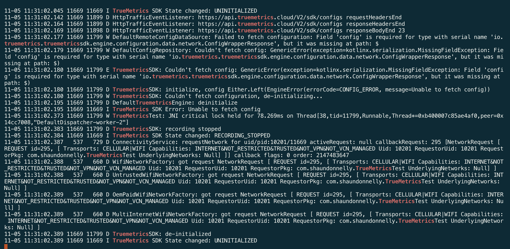

# TrueMetrics Crash PoC

This is an [Expo](https://expo.dev) project created with [`create-expo-app`](https://www.npmjs.com/package/create-expo-app).

The only modifications it has from the vanilla project are:

* A native module has been added (`/modules/truemetrics`)
* In `app.json`, the `expo-build-properties` plugin has been used to give the Android project access to the correct Maven repo that has the TrueMetrics SDK.
* In `app/index.tsx`, the UI allows you to call methods on the TrueMetrics SDK.

## Prerequisites

You need NodeJS 20.

## Get started

1. Install dependencies

   ```bash
   npm install
   ```

2. Run the app on Android

   ```bash
    npm run android
   ```

3. Start streaming Android logs

In a separate tab:

```bash
   adb logcat | grep -i TrueMetrics
```

4. In the app, press "Initialize SDK" and see the errors



## See the error

The app should run fine to start with. However, if you go to the gradle settings for the truemetrics module (`modules/truemetrics/android/build.gradle`) and uncomment out the block at the bottom to include the TrueMetrics SDK, then re-run the app on Android, it should crash on launch.
